# 实时数据架构图

## 架构图

### 实时数据流图:
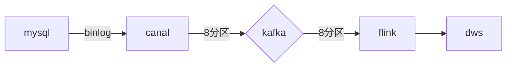
```mermaid
---
title: 
---
graph LR
A[mysql] -- binlog -->B[canal]
    B -- 8分区 --> C{kafka}
    C -- 8分区 --> D[flink]
    D --> E[dws]

```

### 实时维表流图

```mermaid
---
title: 
---
graph LR
a[mysql] -- cdc -->b[flink]
    b -- 写入 --> c[redis]
```
### 离线维表流图

```mermaid
---
title: 
---
graph LR
A[dataworks] -- t+1推送 -->B[dws]
    B -- 定时读取到 --> C[flink]
    C -- 写入 --> D[redis]
```

## 业务流程图

### 订单
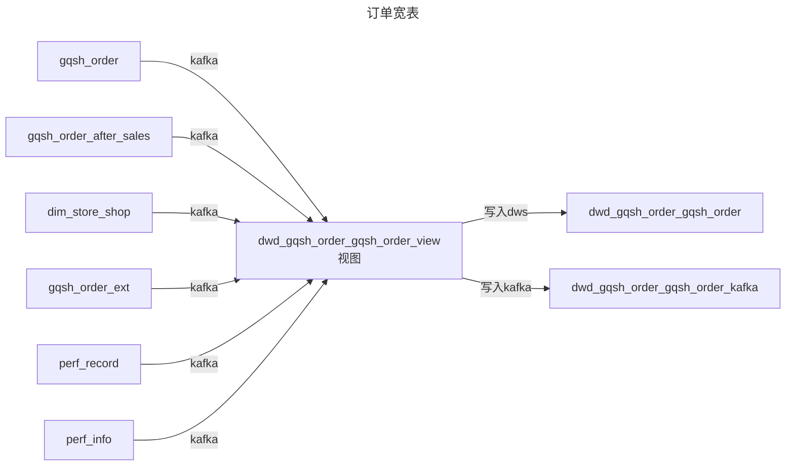
```mermaid
---
title: 订单宽表
---
graph LR
A[gqsh_order] -- kafka -->g[dwd_gqsh_order_gqsh_order_view视图]
B[gqsh_order_after_sales] -- kafka --> g
C[dim_store_shop] -- kafka --> g
d[gqsh_order_ext] -- kafka --> g
e[perf_record] -- kafka --> g
f[perf_info] -- kafka --> g
g -- 写入dws --> j[dwd_gqsh_order_gqsh_order]
g -- 写入kafka --> h[dwd_gqsh_order_gqsh_order_kafka]

```

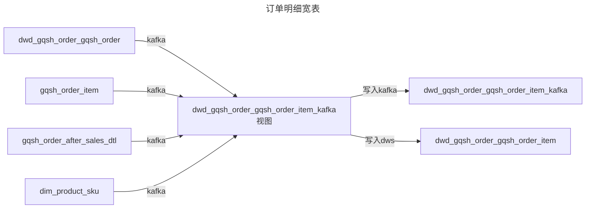
```mermaid
---
title: 订单明细宽表
---
graph LR
h[dwd_gqsh_order_gqsh_order] -- kafka --> k[dwd_gqsh_order_gqsh_order_item_kafka视图]
h1[gqsh_order_item] -- kafka --> k
h2[gqsh_order_after_sales_dtl] -- kafka --> k
h3[dim_product_sku] -- kafka --> k
k -- 写入kafka --> l[dwd_gqsh_order_gqsh_order_item_kafka]
k -- 写入dws --> z[dwd_gqsh_order_gqsh_order_item]
```

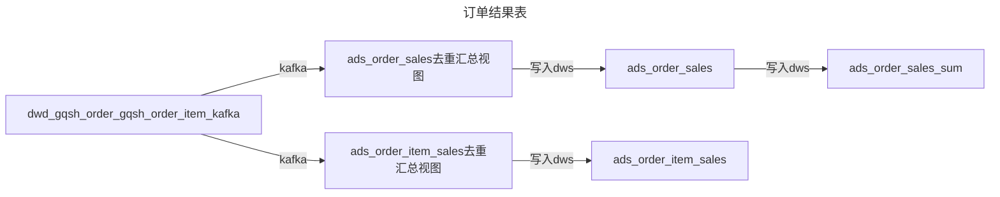
```mermaid
---
title: 订单结果表
---
graph LR
h[dwd_gqsh_order_gqsh_order_item_kafka] -- kafka --> k[ads_order_sales去重汇总视图]
h -- kafka --> l[ads_order_item_sales去重汇总视图]
k -- 写入dws --> a[ads_order_sales]
l -- 写入dws --> b[ads_order_item_sales]
a -- 写入dws --> c[ads_order_sales_sum]
```

### 金蝶
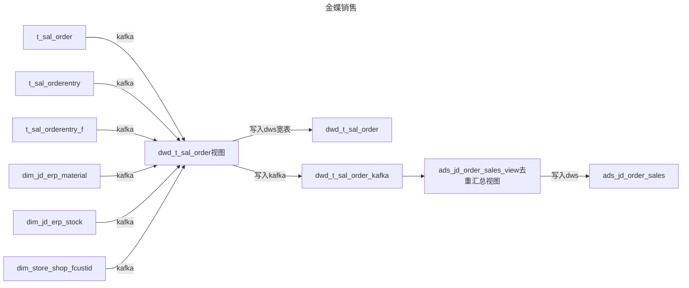
```mermaid
---
title: 金蝶销售
---
graph LR
A[t_sal_order] -- kafka -->g[dwd_t_sal_order视图]
B[t_sal_orderentry] -- kafka --> g
C[t_sal_orderentry_f] -- kafka --> g
d[dim_jd_erp_material] -- kafka --> g
e[dim_jd_erp_stock] -- kafka --> g
f[dim_store_shop_fcustid] -- kafka --> g
g -- 写入dws宽表 --> j[dwd_t_sal_order]
g -- 写入kafka --> h[dwd_t_sal_order_kafka]
h --> z[ads_jd_order_sales_view去重汇总视图 ]
z -- 写入dws --> x[ads_jd_order_sales]
```
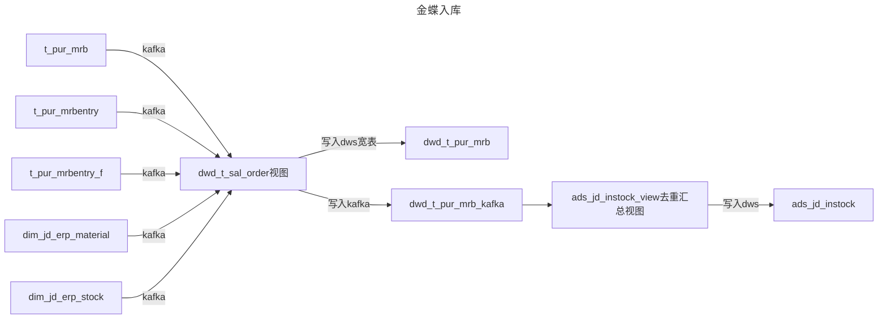
```mermaid
---
title: 金蝶入库
---
graph LR
A[t_pur_mrb] -- kafka -->g[dwd_t_sal_order视图]
B[t_pur_mrbentry] -- kafka --> g
C[t_pur_mrbentry_f] -- kafka --> g
d[dim_jd_erp_material] -- kafka --> g
e[dim_jd_erp_stock] -- kafka --> g
g -- 写入dws宽表 --> j[dwd_t_pur_mrb]
g -- 写入kafka --> h[dwd_t_pur_mrb_kafka]
h --> z[ads_jd_instock_view去重汇总视图 ]
z -- 写入dws --> x[ads_jd_instock]
```

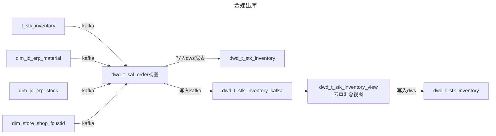
```mermaid
---
title: 金蝶出库
---
graph LR
A[t_stk_inventory] -- kafka -->g[dwd_t_sal_order视图]
B[dim_jd_erp_material] -- kafka --> g
C[dim_jd_erp_stock] -- kafka --> g
f[dim_store_shop_fcustid] -- kafka --> g
g -- 写入dws宽表 --> j[dwd_t_stk_inventory]
g -- 写入kafka --> h[dwd_t_stk_inventory_kafka]
h --> z[dwd_t_stk_inventory_view去重汇总视图 ]
z -- 写入dws --> x[dwd_t_stk_inventory]
```
### pos中心
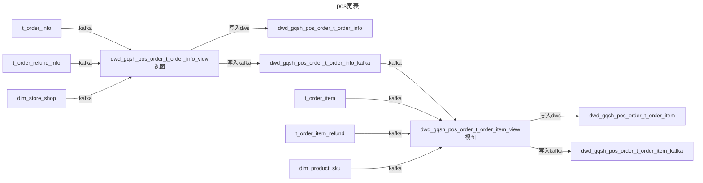
```mermaid
---
title: pos宽表
---
graph LR
A[t_order_info] -- kafka -->g[dwd_gqsh_pos_order_t_order_info_view视图]
B[t_order_refund_info] -- kafka --> g
C[dim_store_shop] -- kafka --> g
g -- 写入dws --> j[dwd_gqsh_pos_order_t_order_info]
g -- 写入kafka --> h[dwd_gqsh_pos_order_t_order_info_kafka]
h -- kafka --> l[dwd_gqsh_pos_order_t_order_item_view视图]
k[t_order_item] -- kafka --> l
k1[t_order_item_refund] -- kafka --> l
k2[dim_product_sku] -- kafka --> l
l -- 写入dws --> z[dwd_gqsh_pos_order_t_order_item]
l -- 写入kafka --> x[dwd_gqsh_pos_order_t_order_item_kafka]
```
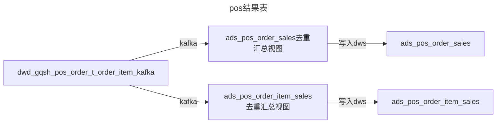
```mermaid
---
title: pos结果表
---
graph LR
h[dwd_gqsh_pos_order_t_order_item_kafka] -- kafka --> k[ads_pos_order_sales去重汇总视图]
h -- kafka --> l[ads_pos_order_item_sales去重汇总视图]
k -- 写入dws --> a[ads_pos_order_sales]
l -- 写入dws --> b[ads_pos_order_item_sales]
```
### 神策实时
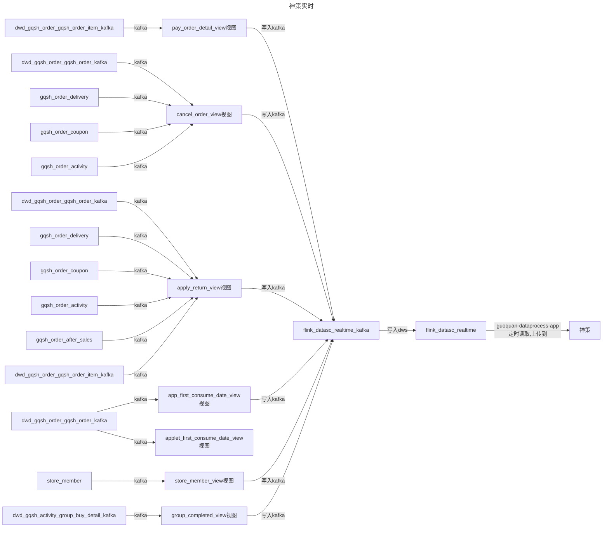
```mermaid
---
title: 神策实时
---
graph LR
a[dwd_gqsh_order_gqsh_order_item_kafka] -- kafka --> b[pay_order_detail_view视图]
b -- 写入kafka --> g[flink_datasc_realtime_kafka]

a1[dwd_gqsh_order_gqsh_order_kafka] -- kafka --> b1[cancel_order_view视图]
a2[gqsh_order_delivery] -- kafka --> b1
a3[gqsh_order_coupon] -- kafka --> b1
a4[gqsh_order_activity] -- kafka --> b1
b1 -- 写入kafka --> g[flink_datasc_realtime_kafka]

aa1[dwd_gqsh_order_gqsh_order_kafka] -- kafka --> bb1[apply_return_view视图]
aa2[gqsh_order_delivery] -- kafka --> bb1
aa3[gqsh_order_coupon] -- kafka --> bb1
aa4[gqsh_order_activity] -- kafka --> bb1
aa5[gqsh_order_after_sales] -- kafka --> bb1
aa6[dwd_gqsh_order_gqsh_order_item_kafka] -- kafka --> bb1
bb1 -- 写入kafka --> g[flink_datasc_realtime_kafka]

c[dwd_gqsh_order_gqsh_order_kafka] -- kafka --> c1[app_first_consume_date_view视图]
c -- kafka --> c2[applet_first_consume_date_view视图]
c1 -- 写入kafka --> g[flink_datasc_realtime_kafka]


d[store_member] -- kafka --> d1[store_member_view视图]
d1 -- 写入kafka --> g[flink_datasc_realtime_kafka]


e[dwd_gqsh_activity_group_buy_detail_kafka] -- kafka --> e1[group_completed_view视图]
e1 -- 写入kafka --> g[flink_datasc_realtime_kafka]

g -- 写入dws --> h[flink_datasc_realtime]

h -- guoquan-dataprocess-app定时读取,上传到 --> j[神策]


```

## 功能蓝图
### 实时功能蓝图
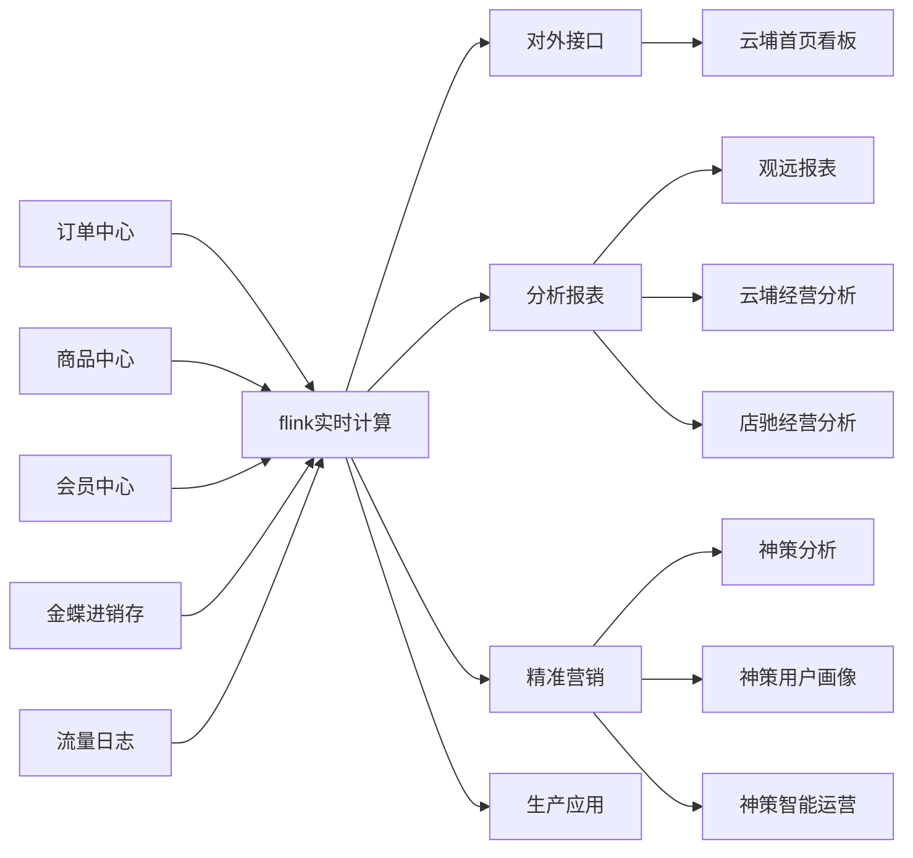
```mermaid
---
title: 
---
graph LR
a[订单中心] -->g[flink实时计算]
b[商品中心] -->g
c[会员中心] -->g
d[金蝶进销存] -->g
e[流量日志] -->g
g -->j1[对外接口]
g -->j2[分析报表]
g -->j4[精准营销]
g -->j3[生产应用]
j1 -->k1[云埔首页看板]
j2 -->k2[观远报表]
j2 -->k3[云埔经营分析]
j2 -->k4[店驰经营分析]
j4 -->l1[神策分析]
j4 -->l2[神策用户画像]
j4 -->l3[神策智能运营]
```