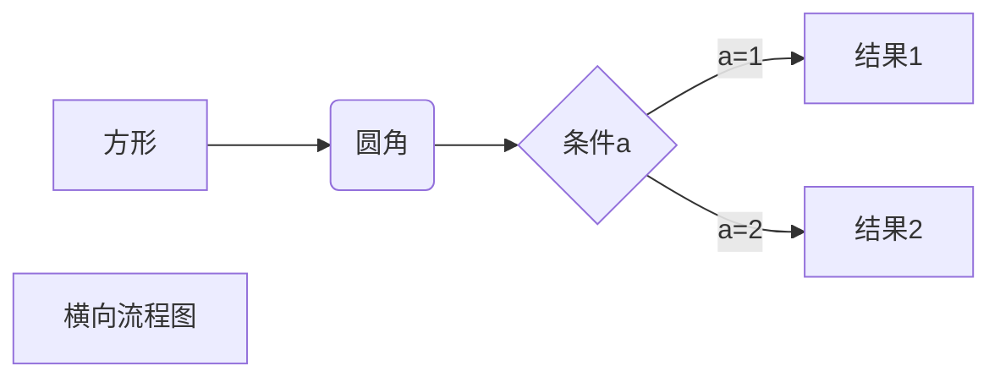

# Markdown

## Markdown 教程 | 菜鸟教程

https://www.runoob.com/markdown/md-tutorial.html


## VuePress Theme Hope Markdown

https://theme-hope.vuejs.press/zh/cookbook/markdown/

## Markdown 增强

https://theme-hope.vuejs.press/zh/guide/markdown/intro.html

## Markdown 流程图

https://theme-hope.vuejs.press/zh/guide/markdown/mermaid.html#流程图



## 代码折叠

```
<details>

<summary>点击展开完整代码</summary>

\```
这里是您的代码
\```

</details>
```


<details>

<summary>点击展开完整代码</summary>

```
这里是您的代码
```

</details>